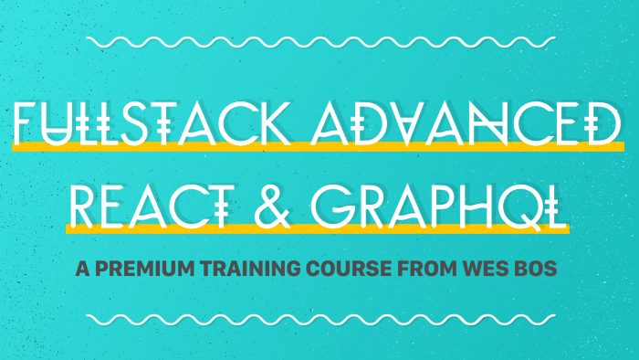

# Advanced React

## Fullstack Advanced React & GraphQL



A Premium Training Course from Wes Bos

- [Fullstack Advanced React & GraphQL][advancedreact]
- [Code on Github][github-advanced-react]

- [Advanced React](#advanced-react)
  - [Fullstack Advanced React & GraphQL](#fullstack-advanced-react--graphql)
  - [Introduction](#introduction)
    - [What Will You Build?](#what-will-you-build)
    - [The Tech Stack of our Application](#the-tech-stack-of-our-application)
    - [What is GraphQL?](#what-is-graphql)
    - [Meet Wes Bos](#meet-wes-bos)
    - [Who is this for?](#who-is-this-for)
    - [Covered Concepts](#covered-concepts)
  - [Module 1. - Introduction and Setup](#module-1---introduction-and-setup)
    - [01 - Tooling and Starter Files Setup (09:33)](#01---tooling-and-starter-files-setup-0933)
      - [Frontend packages](#frontend-packages)
    - [02 - The Tech Stack Explained (07:41)](#02---the-tech-stack-explained-0741)
  - [Module 2. - Learning Next.js](#module-2---learning-nextjs)
    - [03 - An intro to Next (08:52)](#03---an-intro-to-next-0852)

## Introduction

Build an online store with React and GraphQL

Just as React has transformed the way we build web applications, GraphQL is changing how we build APIs to query and mutate data.

With a focus on modern JavaScript and real world application, this course is a start-to-finish way to learn Full Stack Advanced React, Next.js, GraphQL, Node.js and friends.

Join me as I show you how to build a full stack online store with some of today's top JavaScript technology.

### What Will You Build?

Together we will build "Sick Fits", a full stack online clothing store complete with real credit checkout. Users can search, sell, add to cart and checkout their favourite items.

The application has six main models —

- `Users`,
- `Items`,
- `Orders`,
- `CartItems`,
- `OrderItems`, and
- `Roles`

— all of which are relational and showcase the power of relational GraphQL Queries.

The app also includes many server side bits including

- authentication,
- permissions,
- sending email,
- uploading images, and
- charging credit cards.

In addition to building both the frontend and backend of the application, we also spend the last section of the course

- Testing the React application.

For a full list of topics covered, see below.

### The Tech Stack of our Application

- Frontend
  - [React.js][reactjs] For Building The Interface along with:
    - [Next.js][nextjs] for server side rendering, routing and tooling
    - [Styled Components][styled-components] for styling
    - Context for Managing Local State
    - [Apollo's React Hooks][apollo-react-hooks] for interfacing with [Apollo Client][apollographql:apollo-client]
    - [Jest][jest] & [React Testing Library][react-testing-library] for Testing

  - [Apollo Client][apollographql:apollo-client] For Data Management
    - Performing GraphQL Mutations(create, update, delete)
    - Fetching data via [GraphQL Queries][graphql-queries]
    - [Caching GraphQL Data][graphql-caching]
    - Error and Loading UI States
    - Apollo Client replaces the need for redux + data fetching/caching libraries

- Backend
  - [Keystone.js][keystonejs] - A Node.js based GraphQL Server + Headless CMS For:
    - Admin Interface to manage data
    - Provides a set of GraphQL CRUD APIs for a MongoDB or Prisma Database
    - Schema Definition
    - Data Relationships
    - Open Source + Self-hosted
    - Built with Node.js, React + Next.js
    - Implementing Query and Mutation Resolvers
    - Custom Server Side Logic
    - Charging Credit Cards with Stripe
    - Sending Email
    - Performing Authentication
    - Managing + Checking Roles + Permissions

### What is GraphQL?

GraphQL is a type-safe query language for APIs and a runtime for fulfilling those queries with your existing data.

What?! It's a replacement for (or addition to) your REST API and Ajax Calls.

GraphQL requires buy-in from both your client and your server — it then puts the power of requesting only what you want into the client and the business logic of finding and filtering that data into backend resolvers.

Specifically in this course it enables libraries that make caching, loading, error handling and pagination a breeze

Complex Relational Data queries and server-side mutations like signing up or checking-out are a snap with GraphQL.

GraphQL is just a standard and can be implemented in any language or framework.

### Meet Wes Bos

Wes Bos is a Full Stack Developer, Speaker and Teacher from Canada. He is a course creator, works as an independent web developer and is the co-host of Syntax - a popular web development podcast. Wes has taught over 500 students in 200+ classes and spoken at dozens of conferences around the world. Wes wrote his own bio in the third person for some reason.

Wes is the author of React For Beginners, BeginnerJavaScript.com, Learn Node and many other courses which together have sold over 100,000 copies. He is also the author of JavaScript30.com, CSSGrid.io, Flexbox.io and Command Line Power User, a set of free video series. 300,000 people have taken at least one of Wes' free video courses.

- [Twitter - @wesbos][twitter-wesbos]

### Who is this for?

Web developers who want to expand their JavaScript, React and Node skills while learning all about GraphQL.

You should be already familiar with the basics of React - components, state, props, modules and event handlers. If you have taken my React For Beginners course or built a few things in React, you are in good shape.

You should be comfortable with both writing and debugging modern JavaScript including arrow functions, classes, promises, async+await and other commonly used parts of ES6. You of course can take my ES6 for Everyone or Beginner JavaScript to skill up on this!

The backend of the course is written in Node. Prior node knowledge is nice, but not required for this course as you should be able to keep up no problem. You can take Learn Node if you'd like to learn more.

This course requires no knowledge of GraphQL, Keystone, Databases, or testing React components

- Anyone looking to learn the whys and hows of GraphQL
- Web developers who want to get better at JavaScript
- JS developers looking to advance their skills and career
- Bootcamp Graduates (see the FAQ for a student discount!)
- Front End Devs looking to go Full Stack
- Existing Node.js developers looking to learn how GraphQL works with Node
- Anyone who wants to get better at JavaScript and learns well from seeing both fundamental and advanced concepts in practice.

### Covered Concepts

In each video, we learn and implement a concept into our application. Many of the concepts we return to over and over for different parts of the application, hitting and solving new problems each time.

As we build an entire full-stack application, this course covers a ton. Along with general JavaScript best practices, here are some of the things you can expect to learn:

- React Best Practices
- Custom Hooks
- Server Side Rendering
- Styled Components
- Theming
- Routing
- GraphQL Schema
- Queries and Mutations
- Authentication
- Resolvers
- Cache Management
- Loading and Error States
- Sending Email
- Logic and Flow with Async + Await
- Authentication and Permissions
- Charging Credit Cards
- Hosting and Transforming Images
- Pagination
- Forms in React
- Animations
- Third party React Components
- Unit Testing
- Mocking Components
- Deployment

[wesbos.com/uses][wesbos-uses]

## Module 1. - Introduction and Setup

### 01 - Tooling and Starter Files Setup (09:33)

Chrome extensions:

- [React Development Tools][github-react]
- [Apollo Client Development Tool][apollographql:apollo-client-devtool]
- [MongoDB Compass][mongodb-compass]

#### Frontend packages

```shell
npx create-next-app@latest --ts .
```

### 02 - The Tech Stack Explained (07:41)

Front-End:

- [React][reactjs]
- [Next.js][nextjs]
- [Apollo Client][apollographql]
- [Styled Components][styled-components]

Backend:

- [Keystone.js][keystonejs]
- [Node][node]
- [MongoDB][mongodb]

## Module 2. - Learning Next.js

### 03 - An intro to Next (08:52)

- <https://nextjs.org/docs/getting-started>

> <a id="code-03-01">_**Listing 3.1** `pages/index.js`_</a>

```react
export default function() {
  return <div>
    <p>Hello!</p>
  </div>
}
```

```bash
npm run dev
```

[advancedreact]: https://advancedreact.com/ "Fullstack Advanced React & GraphQL"
[apollo-react-hooks]: https://www.apollographql.com/docs/react/v2/api/react-hooks/ "@apollo/react-hooks"
[apollographql:apollo-client]: https://www.apollographql.com/docs/react/ "Introduction to Apollo Client"
[github-advanced-react]: https://github.com/wesbos/Advanced-React "Starter Files and Solutions for Full Stack Advanced React and GraphQL"
[graphql-caching]: https://graphql.org/learn/caching/
[graphql-queries]: https://graphql.org/learn/queries/
[keystonejs]: https://keystonejs.com/ "The superpowered CMS for developers"
[nextjs]: https://nextjs.org/ "The React Framework for Production"
[react-testing-library]: https://testing-library.com/docs/react-testing-library/intro/ "React Testing Library"
[reactjs]: https://reactjs.org/ "A JavaScript library for building user interfaces"
[styled-components]: https://styled-components.com/ "Visual primitives for the component age"
